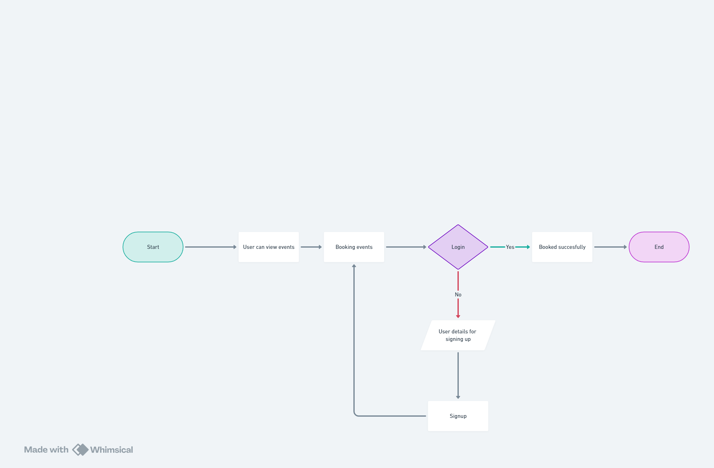
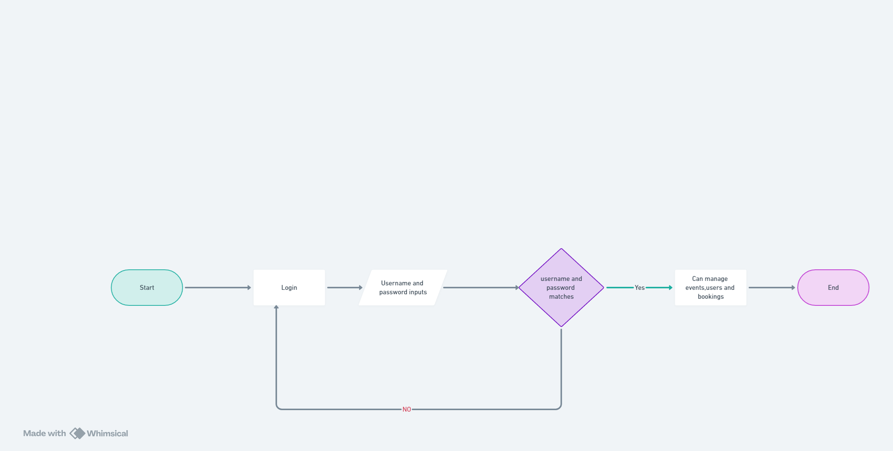
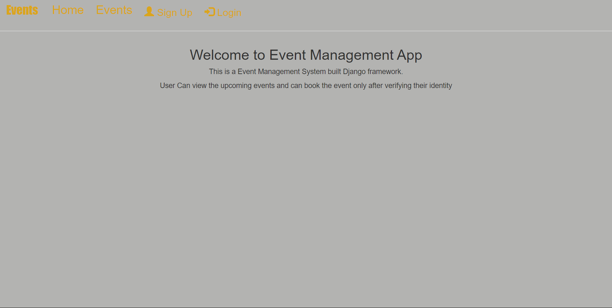
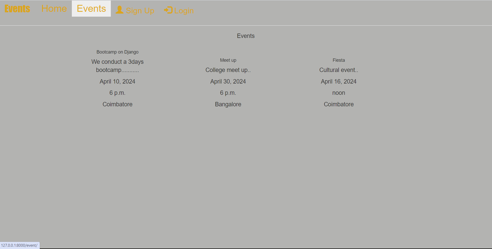
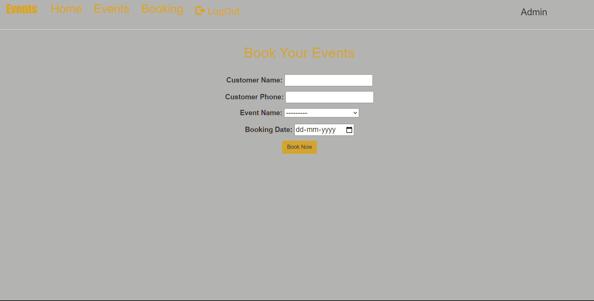
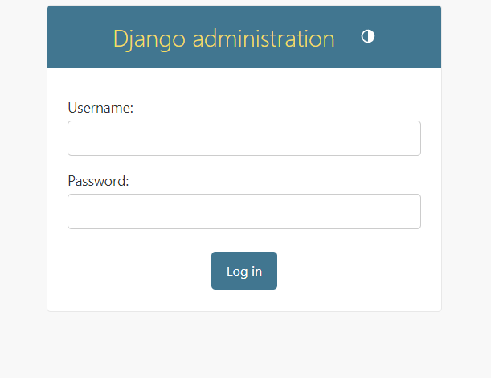
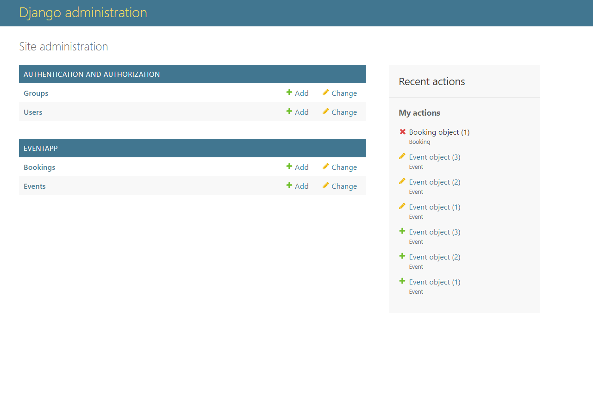
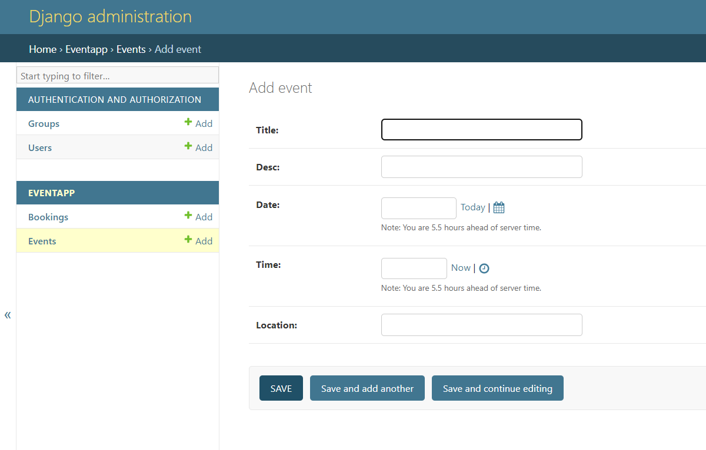

# Event Management System
Welcome to the Event Management System! This aims to provide comprehensive guidance on using the application effectively, from accessing the system to managing bookings.The working flow of the application

## Table of Contents
1. Introduction  
2. Accessing the System  
3. Viewing Available Events  
4. Booking an Event  
5. Viewing and Managing Bookings(By admin)  
6. Flowchart of working flow
7. App Screenshots

### Introduction
The Event Management System is designed to facilitate the management of events, catering to both administrators and users. Administrators have the privilege to manage events, while users can view available events, book them.

### Accessing the System
To get started with the Event Management System, follow these steps:

Ensure System Availability: Make sure that the system is up and running. If not, start the Django development server.

                 "python manage.py runserver"

Access the Web Interface: Open your preferred web browser and enter the URL provided for accessing the system.

### Viewing Available Events
Upon accessing the system, users are presented with a list of available events. Here's how to explore the available events:

Browse Events: On the events page, you'll find a list of events. Each event card typically displays essential details such as the event name, date, and a brief description.

### Booking an Event
Booking an event is a straightforward process. Here's a step-by-step guide:

Sign Up or Log In: If you're a new user, you'll need to sign up for an account. If you already have an account, simply log in to proceed.

Navigate to Booking: Once logged in, navigate to the booking page. This page typically provides a form for entering booking details.

Fill Out the Form: Complete the booking form with the required information. This usually includes the customer name, date, phone number, and any other relevant details.

Submit Your Booking: After filling out the form, review the information provided and submit your booking. Upon successful submission.

### Viewing and Managing Bookings
Administrators have access to a dedicated section for managing bookings. Here's how administrators can view and manage events,bookings and users:

Access Admin Panel: Log in to the admin panel using the administrator credentials.

Once logged in  administrators can  view/modify/delete all details available 

### Flowchart

User:

Admin:

### App screenshots

User perspective:

Admin perspective:

